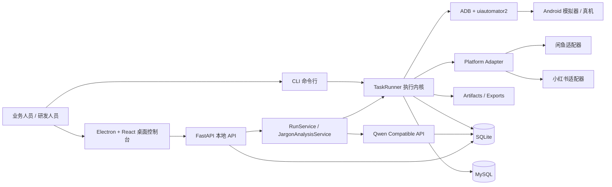
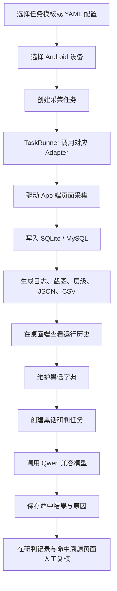

# Android Spider


> 面向内部研判场景的 **Android 端多平台采集与黑话研判桌面工作台**。
>
> 项目通过 `adb + uiautomator2` 驱动模拟器或真机执行闲鱼、小红书采集，结合本地 `FastAPI + Electron + React` 控制台，提供采集任务调度、运行留痕、黑话字典管理、AI 黑话研判、命中溯源与本地文件治理能力。


> 请将实际桌面端截图或演示动图放到 `docs/images/screenshot.png`。
>
> 演示视频占位：`[请在此处替换你的演示视频链接]`

## 📌 项目简介

### 背景与痛点

在内部情报研判与风险线索发现工作中，公开平台内容往往具有以下特点：

- 线索分散在 App 端页面中，无法仅靠网页接口或公开 API 稳定获取
- 目标对象常通过黑话、谐音、包装词、模糊描述规避直接检索
- 采集结果需要结构化留痕，便于后续复盘、比对和人工复核
- 业务操作人员需要可视化工作台，而不是只依赖命令行脚本

`Android Spider` 正是在这一背景下建设的。它不是单纯的“自动化采集脚本”，而是一套围绕 **Android 端采集、运行管控、结构化入库、AI 黑话研判、命中溯源** 建立起来的本地化工作台系统。

### 项目亮点

- **手机端采集闭环**：通过 `adb + uiautomator2` 驱动模拟器或真机，适合处理网页端不可复用的 App 场景
- **桌面控制台**：以 Electron 桌面端承载任务发起、运行历史、字典维护、研判与文件管理
- **双存储策略**：本地 SQLite 管理任务与研判主数据，MySQL 继续承接采集结果同步存储
- **AI 黑话研判**：支持词典管理、分析任务创建、命中结果查看和命中溯源
- **平台化设计**：CLI、FastAPI、本地桌面端共用同一套任务与数据模型
- **可迁移能力**：仓库内保留旧项目 `xianyu/` 作为参考，但当前运行主链路已切换到 Android 端采集体系

### 核心受众

- 内部研发团队
- 情报分析与业务研判人员
- 项目汇报、方案评审与内部交接场景

## ✨ 核心功能特性

### 业务功能

- **多平台 Android 端采集**
  - 闲鱼搜索结果采集
  - 小红书帖子详情采集
  - 小红书一级评论采集
- **运行调度与设备管理**
  - 自动发现在线设备
  - 支持多设备并行采集
  - 单设备互斥执行，避免资源冲突
  - 支持任务取消、运行恢复标记、运行历史查看
- **黑话字典管理**
  - 一级分类管理
  - 二级分类管理
  - 黑话词条及含义维护
- **黑话研判**
  - 从本地采集任务中选择数据源
  - 批量调用 Qwen 兼容模型分析记录
  - 输出状态、命中数、置信度、命中原因
- **命中溯源**
  - 按平台、任务、关键词、分类、置信度过滤命中记录
  - 查看单条命中记录的结构化详情、指标字段与原始文本快照
- **产物与文件治理**
  - 保存截图、层级 XML、可见文本、JSON、CSV、日志
  - 本地文件管理页支持查看和删除受控目录内容

### 技术特性

- **CLI + API + Desktop 三入口统一**
  - CLI 适合开发调试与自动化执行
  - FastAPI 适合本地服务化与桌面端调用
  - Electron 适合业务人员工作台操作
- **Adapter 插件式采集架构**
  - `xianyu_search`
  - `xiaohongshu_search`
  - 可扩展新增平台适配器
- **结构化结果建模**
  - 统一写入 `task_runs`、`collected_records`、`jargon_analysis_tasks`、`jargon_analysis_results`
- **运行留痕**
  - 每次任务生成独立 `artifacts/` 目录
  - 同时落地 `result.json`、日志、截图和导出 CSV

## 🏗️ 系统架构与技术栈

### 技术栈总览

| 层级 | 技术栈 | 版本 / 说明 |
| --- | --- | --- |
| 设备控制 | `adb`、`uiautomator2` | 依赖本地 Android 环境 |
| 采集内核 | Python、PyYAML、自定义 Adapter | Python `>= 3.11` |
| 本地 API | FastAPI、Uvicorn、Pydantic | FastAPI `>= 0.115.0` |
| 桌面端 | Electron、React、TypeScript、electron-vite | Electron `^35.5.1`，React `^19.2.0` |
| 本地存储 | SQLite | 主数据源，位于 `data/local_runs.sqlite3` |
| 外部存储 | MySQL | 采集结果同步存储 |
| AI 依赖 | OpenAI SDK、Qwen 兼容接口 | 默认 DashScope 兼容模式 |
| 部署形态 | Windows 本地运行 | 当前版本未提供官方 Docker 编排 |

### 系统架构图



### 核心业务流程图



### 架构说明

- **采集层**：使用 `adb + uiautomator2` 控制 Android 设备，Adapter 封装闲鱼、小红书等平台逻辑。
- **执行层**：`TaskRunner` 将配置、设备选择、采集、存储、产物输出串成一个完整运行闭环。
- **服务层**：`RunService` 负责任务调度与运行状态，`JargonAnalysisService` 负责黑话分析主链路。
- **接口层**：FastAPI 将设置、任务、字典、研判与文件治理能力统一暴露给桌面端。
- **表现层**：Electron + React 桌面端承载主要工作流。

## 🗂️ 目录结构

```text
android-spider/
├── README.md                     # 项目说明文档
├── .env.example                  # AI 研判环境变量模板
├── .env                          # 本地环境变量（勿提交真实密钥）
├── requirements.txt              # Python 依赖
├── main.py                       # CLI 入口：doctor / run / serve / dump-page
├── configs/                      # 任务模板 YAML
├── scripts/                      # Windows 环境准备与 Demo 脚本
├── src/                          # Python 核心代码
│   ├── adapters/                 # 平台适配器（闲鱼 / 小红书等）
│   ├── api/                      # FastAPI 本地 API
│   ├── core/                     # ADB、Driver、TaskRunner、产物管理
│   ├── models/                   # 配置与数据模型
│   ├── services/                 # 设置、运行、字典、黑话研判、文件服务
│   ├── storage/                  # SQLite / MySQL 存储层
│   └── utils/                    # 配置加载、日志、依赖检查、异常
├── desktop/                      # 当前正式桌面端（Electron + React + TypeScript）
├── data/                         # 本地 SQLite 数据目录
├── artifacts/                    # 任务运行现场产物
├── exports/                      # 导出文件
├── logs/                         # 日志目录
├── xianyu/                       # 旧项目迁移参考代码，不参与当前运行
└── dYm/                          # 独立并行项目目录，不属于当前运行主链路
```

### 重点目录说明

- `configs/`
  - 存放闲鱼与小红书的 YAML 任务模板
- `src/adapters/`
  - 平台级采集实现
- `src/core/`
  - 设备连接、任务执行、页面抓取、产物输出
- `src/services/`
  - 运行管理、系统设置、黑话字典、研判任务、文件治理
- `src/storage/`
  - `sqlite_store.py`：运行历史、结构化记录、系统设置
  - `analysis_store.py`：黑话字典、黑话研判任务与结果
  - `result_store.py`：MySQL 同步写入
- `desktop/`
  - 当前正式使用的本地桌面工作台
- `xianyu/`
  - 旧网页端爬虫项目迁移参考代码
- `dYm/`
  - 仓库中存在的独立 Electron 项目副本，**不应作为当前系统前端理解**

## 🚀 快速开始

## 1. 环境前置要求

请先确认以下依赖已就绪：

| 组件 | 要求 |
| --- | --- |
| Windows | 建议 Windows 10 / 11 |
| PowerShell | 建议 PowerShell 7 |
| Python | `>= 3.11` |
| Node.js | `>= 18` |
| npm | 建议 `>= 9` |
| ADB | 可正常执行 `adb devices` |
| Android 设备 | 模拟器或真机至少 1 台在线 |
| MySQL | 可连接，可创建数据库 |

> 当前版本主要面向 **Windows 本地运行**。仓库未提供官方 Docker 编排。

## 2. 克隆项目

```powershell
git clone https://github.com/WuheSAkura/android-spider.git
Set-Location D:\CodeList\android-spider
```

## 3. 安装 Python 依赖

### 方式 A：使用一键脚本

```powershell
.\scripts\setup_windows.ps1
```

### 方式 B：手动安装

```powershell
py -3.11 -m venv .venv
.\.venv\Scripts\python.exe -m pip install --upgrade pip
.\.venv\Scripts\python.exe -m pip install -r requirements.txt
```

## 4. 安装桌面端依赖

```powershell
Set-Location .\desktop
npm install
Set-Location ..
```

## 5. 配置环境变量

复制模板文件：

```powershell
Copy-Item .env.example .env
```

当前 `.env.example` 仅包含 AI 研判相关配置：

| 变量 | 说明 |
| --- | --- |
| `QWEN_API_KEY` | 必填，Qwen 兼容接口 API Key |
| `QWEN_BASE_URL` | 可选，默认 DashScope 兼容端点 |
| `QWEN_MODEL` | 可选，默认 `qwen-plus` |

示例：

```env
QWEN_API_KEY=your_qwen_api_key_here
QWEN_BASE_URL=https://dashscope.aliyuncs.com/compatible-mode/v1
QWEN_MODEL=qwen-plus
```

> 注意：**不要将真实 API Key 提交到版本库。**

### 重要说明：运行设置不在 `.env`

当前项目还有一类关键运行设置，并不通过 `.env` 管理，而是保存在本地 SQLite 的 `settings` 表中：

- `adb_path`
- `output_dir`
- `mysql_host`
- `mysql_port`
- `mysql_user`
- `mysql_password`
- `mysql_database`
- `mysql_charset`

这些设置可通过以下方式维护：

1. 启动桌面端后在“系统设置”页面填写
2. 调用本地 API `PUT /api/settings`

因此，**`.env` 只负责 AI 研判配置，不负责设备路径和数据库地址。**

## 6. 准备 Android 设备

确认设备在线：

```powershell
adb devices
```

支持以下场景：

- Android Studio Emulator
- 其它可通过 `adb` 接入的模拟器
- 真机

## 7. 执行环境检查

```powershell
.\.venv\Scripts\python.exe .\main.py doctor
```

如果系统找不到 `adb`，可显式指定：

```powershell
.\.venv\Scripts\python.exe .\main.py doctor --adb-path D:\Android\platform-tools\adb.exe
```

## 8. 本地运行方式

### 方式 A：命令行执行采集任务

闲鱼：

```powershell
.\.venv\Scripts\python.exe .\main.py run --config .\configs\xianyu_search_demo.yaml
```

小红书：

```powershell
.\.venv\Scripts\python.exe .\main.py run --config .\configs\xiaohongshu_search_demo.yaml
```

### 方式 B：单独启动本地 API

```powershell
.\.venv\Scripts\python.exe .\main.py serve --host 127.0.0.1 --port 8765
```

启动后可访问：

- 健康检查：`http://127.0.0.1:8765/api/health`

### 方式 C：启动桌面端工作台

```powershell
Set-Location .\desktop
npm run dev
```

桌面端会自动：

- 检查并拉起本地 Python 服务
- 默认连接项目根目录 `.venv\Scripts\python.exe`
- 通过 `http://127.0.0.1:8765` 调用本地 API

### 方式 D：导出当前页面现场

```powershell
.\.venv\Scripts\python.exe .\main.py dump-page
```

## 9. 首次运行建议顺序

1. 安装 Python 与桌面端依赖
2. 准备 `.env`
3. 确认 `adb devices` 可看到在线设备
4. 执行 `main.py doctor`
5. 启动桌面端 `desktop/npm run dev`
6. 在“系统设置”中填写 MySQL、ADB、输出目录
7. 在“发起任务”页面选择模板和设备开始采集
8. 完成后再进入黑话字典、黑话研判、命中溯源页面

## 📦 Docker 部署

当前仓库 **未提供官方 `Dockerfile` 或 `docker-compose.yml`**，因此本版本不建议直接按容器化方案部署。

原因如下：

- 采集依赖本地 `adb` 与 Android 设备连接
- 桌面端为 Electron 本地工作台，不是纯浏览器应用
- 当前运行链路更适合“Windows 本机 + 模拟器 / 真机”的交互式部署方式

如果后续需要容器化，建议按以下方向拆分：

1. 将 `FastAPI + Python 采集内核` 封装为服务容器
2. 将 `ADB / 设备桥接` 设计为宿主机能力或远程设备服务
3. 将 Electron 桌面端与后端采集服务解耦

## 🧪 使用说明 / API 示例

> 桌面端所有主要操作本质上都是通过本地 FastAPI 完成。下面给出两个最核心的接口示例。

### 示例 1：创建采集任务

先确保本地 API 已启动，并且系统设置中已保存 MySQL 与 ADB 配置。

```bash
curl -X POST "http://127.0.0.1:8765/api/runs" \
  -H "Content-Type: application/json" \
  -d '{
    "template_id": "xianyu_search",
    "device_serial": null,
    "run_mode": "normal",
    "adapter_options": {
      "search_keyword": "iPhone15",
      "max_items": 10,
      "max_scrolls": 10,
      "max_idle_rounds": 3,
      "settle_seconds": 1.0,
      "search_timeout": 20
    }
  }'
```

示例返回：

```json
{
  "id": 21,
  "task_name": "xianyu_search_demo",
  "adapter": "xianyu_search",
  "platform": "xianyu",
  "package_name": "com.taobao.idlefish",
  "run_mode": "normal",
  "status": "pending",
  "device_serial": "",
  "requested_at": "2026-04-11 20:10:00",
  "artifact_dir": "",
  "log_path": "",
  "config": {
    "template_id": "xianyu_search",
    "device_serial": "",
    "run_mode": "normal",
    "adapter_options": {
      "search_keyword": "iPhone15",
      "max_items": 10
    }
  },
  "result": {},
  "error_message": "",
  "mysql_run_id": null,
  "items_count": 0,
  "comment_count": 0,
  "cancel_requested": false,
  "created_at": "2026-04-11 20:10:00",
  "updated_at": "2026-04-11 20:10:00"
}
```

### 示例 2：创建黑话研判任务

在已有采集任务和黑话词条的前提下：

```bash
curl -X POST "http://127.0.0.1:8765/api/jargon-analysis/tasks" \
  -H "Content-Type: application/json" \
  -d '{
    "source_type": "xianyu",
    "source_task_id": 21,
    "keyword_id": 3
  }'
```

示例返回：

```json
{
  "id": 8,
  "source_type": "xianyu",
  "source_task_id": 21,
  "source_task_name": "iPhone15",
  "keyword_id": 3,
  "keyword_name": "暗语示例",
  "keyword_meaning": "用于指代某类风险商品的隐晦说法",
  "category_name": "风险分类",
  "subcategory_name": "重点词条",
  "status": "pending",
  "total_records": 10,
  "processed_records": 0,
  "matched_records": 0,
  "error_message": "",
  "created_at": "2026-04-11 20:20:00",
  "started_at": "",
  "completed_at": "",
  "updated_at": "2026-04-11 20:20:00"
}
```

### 常用接口清单

- `GET /api/health`
- `GET /api/system/doctor`
- `GET /api/system/devices`
- `GET /api/task-templates`
- `GET /api/settings`
- `PUT /api/settings`
- `GET /api/runs`
- `POST /api/runs`
- `POST /api/runs/{run_id}/cancel`
- `GET /api/jargon-analysis/sources`
- `POST /api/jargon-analysis/tasks`
- `GET /api/jargon-analysis/tasks/{task_id}/results`
- `GET /api/jargon-analysis/matches`
- `GET /api/files`

## 🤝 二次开发与贡献指南

### 开发原则

- **采集逻辑优先放在 `src/adapters/` 和 `src/core/`，不要直接堆在接口层。**
- **运行状态、记录、设置优先复用 SQLite 主数据模型。**
- **黑话研判相关能力优先复用 `analysis_store.py` 和 `/api/jargon-analysis/*` 链路。**
- **新增平台时先统一结构化字段，再决定是否接入黑话研判。**

### 推荐开发入口

- 新增平台采集：`src/adapters/`
- 新增任务模板：`configs/`
- 新增本地 API：`src/api/app.py`
- 新增桌面页：`desktop/src/renderer/src/pages/`
- 新增存储字段：`src/storage/sqlite_store.py`、`src/storage/analysis_store.py`

### 提交 Issue / 变更说明建议

提交问题或内部变更说明时，建议至少包含：

- 问题现象
- 复现步骤
- 设备信息与 Android 版本
- 任务模板与关键参数
- 日志片段、截图或 `artifacts/` 路径

### 代码规范建议

#### Python 侧

- 明确使用类型注解
- 保持 `TaskRunner -> Adapter -> Store` 分层清晰
- 不要将平台特定逻辑硬编码到通用服务层

#### 桌面端

- 使用 TypeScript
- 页面与 API 类型定义保持一致
- 不要直接绕过 `desktop/src/renderer/src/lib/api.ts` 访问后端

## 🛠️ 常见问题排查

### 1. `doctor` 检查失败，提示找不到 ADB 或没有在线设备

排查方向：

- 确认 `adb` 已加入 PATH
- 执行 `adb devices` 查看是否能看到设备
- 如未加入 PATH，可在系统设置中填写 `adb_path`，或执行：

```powershell
.\.venv\Scripts\python.exe .\main.py doctor --adb-path D:\Android\platform-tools\adb.exe
```

### 2. 桌面端启动后提示 Python 服务无法拉起

排查方向：

- 确认根目录存在 `.venv\Scripts\python.exe`
- 确认已安装 `requirements.txt`
- 可先手动验证：

```powershell
.\.venv\Scripts\python.exe .\main.py serve --host 127.0.0.1 --port 8765
```

- 如果手动能起，问题通常在 Electron 启动环境或路径解析

### 3. 采集任务创建成功但执行失败，或 MySQL 写入异常

排查方向：

- 当前采集执行链路会在运行时连接 MySQL，MySQL 并非可忽略项
- 请确认“系统设置”中：
  - `mysql_host`
  - `mysql_port`
  - `mysql_user`
  - `mysql_password`
  - `mysql_database`
  配置正确
- 检查 MySQL 服务是否可连接、账号是否有建库建表权限

## 🗺️ TODO / 未来规划

- [ ] 将桌面端、Python 内核和设备桥接进一步解耦
- [ ] 增加更多平台 Adapter，并统一结构化字段标准
- [ ] 扩展黑话研判范围，将小红书评论纳入主分析链路
- [ ] 增加 OCR、图片识别等多模态分析能力
- [ ] 提供更完整的任务调度和失败重试机制
- [ ] 增加正式的容器化部署方案与运维脚本
- [ ] 完善前后端自动化校验与 CI 流程
- [ ] 增加更强的命中聚合与案件线索串并分析能力

## 📄 许可证与版权声明

当前仓库 **未声明开源协议**。

因此，默认按以下原则理解：

- **仅供内部使用**
- **版权归项目 / 团队所有**
- 未经明确授权，不应将仓库代码、配置、数据样本、截图和业务材料作为开源资产对外分发

补充说明：

- 仓库中涉及的目标平台内容、用户内容、截图与导出文件，其权利归属仍以原始平台和原始内容权利人为准
- 若本项目用于内部汇报、评审或演示，请注意脱敏处理设备信息、账号信息、数据库地址与 API Key

---

## 📎 附录说明

### 当前运行边界

- 当前正式运行链路：根目录 `main.py + src/ + desktop/`
- `xianyu/`：旧项目迁移参考，不参与当前运行
- `dYm/`：独立并行项目目录，不属于当前系统前端

### 可直接运行的模板与脚本

- `configs/xianyu_search_demo.yaml`
- `configs/xiaohongshu_search_demo.yaml`
- `configs/settings_demo.yaml`
- `scripts/setup_windows.ps1`
- `scripts/run_xianyu_demo.ps1`
- `scripts/run_xiaohongshu_demo.ps1`
- `scripts/run_settings_demo.ps1`

### 建议补充的仓库资源

- `[请在此处补充 docs/images/screenshot.png]`
- `[请在此处补充演示视频或 GIF]`
- `[请在此处补充更正式的版本发布说明]`
